# Backend-to-Agent Communication System Design

This document provides comprehensive system design documentation for the backend-to-agent communication system
implementing ADR #8's hybrid SSE + HTTP architecture. This system enables real-time delivery of microscope control
instructions from Kubernetes-hosted backend services to Windows workstations controlling
cryo-electron microscopes.

## Architecture Overview

### System Context

The SmartEM Decisions platform operates in a distributed environment where backend services run in Kubernetes clusters
whilst agent services execute on Windows workstations directly connected to scientific equipment.
The communication system bridges this divide whilst meeting high-throughput requirements.

**Implementation Status**: **COMPLETED** - This POC implementation provides a production-ready backend-to-agent
communication system with full SSE streaming, RabbitMQ integration, database persistence, and comprehensive
connection management.


### Service Architecture

The communication system employs a **separate service approach** rather than integrating directly with the main API
service. This design provides:

- **Isolation of concerns**: Communication logic remains separate from core business logic
- **Scalability independence**: Communication service can scale independently based on connection load
- **Operational simplicity**: Monitoring and debugging of persistent connections without affecting main API
- **Resource management**: Dedicated resources for managing long-lived SSE connections


## Technical Stack Integration

### FastAPI Integration

The communication service leverages FastAPI's native SSE support through `StreamingResponse` and event streaming
patterns:

```python
# Conceptual endpoint structure
@app.get("/agent/{agent_id}/instructions/stream")
async def stream_instructions(agent_id: str):
    """SSE endpoint for streaming instructions to agents"""
    
@app.post("/agent/{agent_id}/instructions/{instruction_id}/ack")
async def acknowledge_instruction(agent_id: str, instruction_id: str):
    """HTTP endpoint for instruction acknowledgements"""
```

### RabbitMQ Message Flow

The system integrates with the existing RabbitMQ infrastructure as an event communication backbone between ML components and the communication service:


### PostgreSQL Schema Design

The communication system extends the existing database schema with instruction tracking tables:

```sql
-- Conceptual schema structure
CREATE TABLE agent_instructions (
    id UUID PRIMARY KEY,
    agent_id VARCHAR NOT NULL,
    instruction_type VARCHAR NOT NULL,
    payload JSONB NOT NULL,
    created_at TIMESTAMP WITH TIME ZONE NOT NULL,
    delivered_at TIMESTAMP WITH TIME ZONE,
    acknowledged_at TIMESTAMP WITH TIME ZONE,
    status VARCHAR NOT NULL DEFAULT 'pending',
    retry_count INTEGER DEFAULT 0
);

CREATE TABLE agent_connections (
    agent_id VARCHAR PRIMARY KEY,
    connection_id VARCHAR NOT NULL,
    connected_at TIMESTAMP WITH TIME ZONE NOT NULL,
    last_heartbeat TIMESTAMP WITH TIME ZONE,
    connection_type VARCHAR NOT NULL -- 'sse'
);
```

## Component Interactions and Data Flows

### Primary Communication Flow (SSE)

The primary communication path uses Server-Sent Events for efficient real-time instruction delivery:


### Error Handling and Recovery

The system implements comprehensive error handling across multiple failure scenarios:

```mermaid
graph TD
    start([Instruction Generated]) --> sse{SSE Connected?}
    
    sse -->|Yes| stream[Stream via SSE]
    sse -->|No| queue[Queue for Next Connection]
    
    stream --> ack{Acknowledgement Received?}
    ack -->|Yes| complete[Mark Complete]
    ack -->|No| retry{Retry Count < Max?}
    
    retry -->|Yes| delay[Exponential Backoff]
    retry -->|No| failed[Mark Failed]
    
    delay --> reconnect[Reconnect SSE]
    reconnect --> stream
    
    queue --> reconnect
    failed --> end([End])
    complete --> end([End])
```

## Scalability Design

### Connection Management

The system is designed to support **one session per agent machine** with a capacity of **20 concurrent SSE
connections**. This design aligns with the facility's requirements of up to 20 microscope workstations, where each workstation controls
a single microscope.


### Theoretical Scaling Limits

**Current Architecture Bottlenecks:**

1. **Database Write Performance**: High-frequency instruction persistence and state updates may impact database performance
2. **Database Connection Pool**: Connection pool limits for concurrent instruction storage and retrieval operations
3. **Memory Usage**: Each SSE connection maintains in-memory state (~1-2MB per connection)
4. **RabbitMQ Throughput**: Event notification capacity for real-time updates

**Scaling Strategies:**

- **Horizontal Scaling**: Deploy multiple communication service instances behind load balancer
- **Connection Sharding**: Distribute agents across service instances by agent ID hash
- **Resource Optimization**: Implement connection pooling and memory-efficient streaming
- **Database Optimization**: Use connection pooling and read replicas for instruction queries

### Performance Characteristics

**Expected Throughput:**
- **Instruction Frequency**: 1 instruction per 30-120 seconds per agent during active data collection
- **Peak Load**: 20 agents × 2 instructions/minute = 40 instructions/minute system-wide (at maximum frequency)
- **Message Size**: 1-10KB JSON payloads for microscope control instructions
- **Latency Requirements**: Sub-second delivery for real-time workflow efficiency

## Implementation Specifications

### SSE Streaming Service Design

The SSE streaming service implements persistent connections with automatic reconnection handling:

```python
# Conceptual implementation structure
class SSEInstructionStream:
    """Manages SSE connections and instruction streaming"""
    
    async def stream_instructions(self, agent_id: str) -> AsyncIterator[str]:
        """Async generator for SSE instruction stream"""
        
    async def handle_connection_lifecycle(self, agent_id: str):
        """Manages connection establishment, maintenance, and cleanup"""
        
    async def process_pending_instructions(self, agent_id: str):
        """Retrieves and processes pending instructions from database for SSE delivery"""

class ConnectionManager:
    """Manages active SSE connections and health monitoring"""
    
    def register_connection(self, agent_id: str, connection_id: str):
        """Register new SSE connection"""
        
    def cleanup_connection(self, agent_id: str):
        """Clean up disconnected SSE connection"""
        
    async def health_check_connections(self):
        """Monitor connection health and handle failures"""
```

### HTTP Acknowledgement Endpoints

HTTP acknowledgement endpoints provide reliable delivery confirmation:

```python
# Conceptual acknowledgement handling
@dataclass
class InstructionAcknowledgement:
    instruction_id: str
    agent_id: str
    acknowledged_at: datetime
    status: Literal["received", "processed", "failed"]
    error_message: str | None = None

class AcknowledgementHandler:
    """Handles instruction acknowledgements and delivery tracking"""
    
    async def process_acknowledgement(
        self, 
        ack: InstructionAcknowledgement
    ) -> bool:
        """Process and store instruction acknowledgement"""
        
    async def handle_declined_instruction(
        self, 
        agent_id: str, 
        instruction_id: str, 
        reason: str
    ):
        """Handle agent declining instruction execution"""
```

### SSE Retry Implementation

The system implements robust SSE reconnection with exponential backoff:

```python
class SSERetryManager:
    """Manages SSE connection retry logic with exponential backoff"""
    
    def should_retry(self, agent_id: str, attempt_count: int) -> bool:
        """Determine if SSE connection should be retried"""
        
    def calculate_backoff_delay(self, attempt_count: int) -> int:
        """Calculate exponential backoff delay for reconnection"""
        
    async def reconnect_with_backoff(self, agent_id: str) -> bool:
        """Attempt SSE reconnection with backoff delay"""
```

## Implementation Status & Components

This POC implementation provides a complete working system with the following implemented components:

### Completed Features

#### 1. Database Schema & Migration (Alembic)
- **AgentSession**: Session management for agent connections
- **AgentInstruction**: Instruction storage with metadata and lifecycle tracking
- **AgentConnection**: Real-time connection tracking with heartbeat monitoring
- **AgentInstructionAcknowledgement**: Comprehensive acknowledgement tracking

#### 2. FastAPI SSE Endpoints
- **`/agent/{agent_id}/session/{session_id}/instructions/stream`**: Real-time SSE streaming
- **`/agent/{agent_id}/session/{session_id}/instructions/{instruction_id}/ack`**: HTTP acknowledgement
- **Debug endpoints**: Connection statistics and session management

#### 3. RabbitMQ Integration
- **Event Publishers**: Agent instruction lifecycle events
- **Consumer Handlers**: Process instruction events and database updates
- **Message Types**: `agent.instruction.created`, `agent.instruction.updated`, `agent.instruction.expired`

#### 4. Enhanced Agent Client (`SSEAgentClient`)
- **Exponential backoff retry logic** with jitter
- **Connection statistics and monitoring**
- **Comprehensive error handling and recovery**
- **Processing time tracking for performance metrics**

#### 5. Connection Management Service (`AgentConnectionManager`)
- **Automatic stale connection cleanup** (2-minute timeout)
- **Instruction expiration handling** with retry logic
- **Session activity monitoring** (1-hour inactivity threshold)
- **Real-time statistics and health monitoring**

#### 6. Production-Ready Example Client
- **Complete instruction processing workflow**
- **Multiple instruction type support** (stage movement, image acquisition)
- **Processing time measurement and acknowledgement**
- **Enhanced error handling and statistics display**

### 🚀 Key Implementation Highlights

- **Database-backed persistence**: All instruction state persisted with full audit trail
- **Connection resilience**: Automatic reconnection with exponential backoff
- **Health monitoring**: Background tasks for cleanup and monitoring
- **Production logging**: Comprehensive logging at all system levels
- **Type safety**: Full Pydantic model validation throughout
- **Test-friendly design**: Debug endpoints for system verification

## Message Lifecycle Management

### Sequential Delivery Requirements

The system ensures **sequential message delivery** to maintain microscope control instruction ordering:


### Database Persistence Strategy

The system uses **PostgreSQL as source of truth** with RabbitMQ as the event communication backbone:


### Agent Restart Message Replay (TODO)

**Current Status**: Not implemented - marked as future requirement

**Design Considerations**:
- Determine replay window (e.g., last 24 hours of unacknowledged instructions)
- Handle duplicate instruction detection and prevention
- Manage instruction sequence numbering across agent restarts
- Implement replay request mechanism from agent on startup


## External Message Types and Transformation Pipeline

### External Message Types

The system processes external RabbitMQ messages from data processing pipelines and machine learning components
to trigger real-time decision-making and microscope control instructions. These external messages represent
completion events from various stages of the cryo-EM data processing workflow:

**Primary External Message Types:**
- **MOTION_CORRECTION_COMPLETE**: Indicates completion of motion correction processing for collected images
- **CTF_COMPLETE**: Signals completion of contrast transfer function (CTF) estimation for image quality assessment
- **PARTICLE_PICKING_COMPLETE**: Notifies completion of automated particle identification in micrographs
- **PARTICLE_SELECTION_COMPLETE**: Indicates completion of particle quality assessment and selection
- **GRIDSQUARE_MODEL_PREDICTION**: Provides machine learning predictions for gridsquare quality and suitability
- **FOILHOLE_MODEL_PREDICTION**: Delivers ML predictions for individual foilhole targeting recommendations
- **MODEL_PARAMETER_UPDATE**: Communicates updates to ML model parameters affecting decision thresholds

These external messages contain scientific data processing results, quality metrics, and ML predictions that drive
the backend's decision logic for microscope control instructions.

### Message Transformation Pipeline

The transformation pipeline converts external data processing events into actionable SSE instructions for agents.
This pipeline operates within the `consumer.py` component and implements the core business logic for scientific
decision-making:


**Transformation Process:**

1. **Message Reception**: External messages arrive via dedicated RabbitMQ queues with processing results
2. **Data Extraction**: Consumer extracts quality metrics, coordinates, and prediction values from message payloads
3. **Decision Logic Application**: Business rules evaluate data against configurable quality thresholds
4. **Instruction Generation**: Decision outcomes generate specific microscope control instructions
5. **Traceability Injection**: Instructions include metadata linking back to originating external messages
6. **SSE Delivery**: Generated instructions are queued for real-time delivery to appropriate agents

**Quality Threshold Examples:**
```json
{
  "gridsquare_quality_threshold": 0.7,
  "foilhole_ice_thickness_max": 150.0,
  "ctf_resolution_minimum": 4.0,
  "motion_correction_drift_max": 2.0
}
```

### Athena API Control Instructions

The system generates specific instruction types that correspond to Athena API control capabilities for microscope
workflow management. These instructions represent the actionable outputs of the decision-making process:

**Primary Control Instruction Types:**

#### athena.control.reorder_foilholes
Reorders foilhole acquisition sequence based on ML predictions and quality assessments:

```json
{
  "instruction_id": "uuid-v4",
  "instruction_type": "athena.control.reorder_foilholes",
  "version": "1.0",
  "timestamp": "2025-09-23T10:30:00Z",
  "payload": {
    "gridsquare_id": "GS_001_002",
    "foilhole_order": [
      {"foilhole_id": "FH_001", "priority_score": 0.95},
      {"foilhole_id": "FH_003", "priority_score": 0.87},
      {"foilhole_id": "FH_002", "priority_score": 0.72}
    ],
    "reorder_reason": "ml_prediction_update"
  },
  "metadata": {
    "session_id": "session-uuid",
    "originating_message_id": "external-msg-uuid",
    "decision_timestamp": "2025-09-23T10:29:45Z",
    "quality_threshold": 0.7
  }
}
```

#### athena.control.reorder_gridsquares
Reorders gridsquare acquisition sequence based on overall quality assessments:

```json
{
  "instruction_id": "uuid-v4",
  "instruction_type": "athena.control.reorder_gridsquares",
  "version": "1.0",
  "timestamp": "2025-09-23T10:35:00Z",
  "payload": {
    "gridsquare_order": [
      {"gridsquare_id": "GS_001_003", "quality_score": 0.92},
      {"gridsquare_id": "GS_001_001", "quality_score": 0.88},
      {"gridsquare_id": "GS_001_002", "quality_score": 0.74}
    ],
    "reorder_strategy": "quality_optimised"
  },
  "metadata": {
    "session_id": "session-uuid",
    "originating_message_id": "gridsquare-prediction-uuid",
    "model_version": "v2.1.0",
    "prediction_confidence": 0.89
  }
}
```

#### athena.control.skip_gridsquares
Skips gridsquares that fail to meet quality thresholds:

```json
{
  "instruction_id": "uuid-v4",
  "instruction_type": "athena.control.skip_gridsquares",
  "version": "1.0",
  "timestamp": "2025-09-23T10:40:00Z",
  "payload": {
    "gridsquares_to_skip": [
      {
        "gridsquare_id": "GS_001_005",
        "skip_reason": "quality_below_threshold",
        "quality_score": 0.45
      },
      {
        "gridsquare_id": "GS_001_007",
        "skip_reason": "ice_contamination_detected",
        "contamination_level": 0.85
      }
    ],
    "skip_strategy": "quality_based"
  },
  "metadata": {
    "session_id": "session-uuid",
    "originating_message_id": "quality-assessment-uuid",
    "threshold_applied": 0.6,
    "assessment_method": "ml_classification"
  }
}
```

### Complete Message Flow Diagram

The following diagram illustrates the complete message flow from external systems through to microscope control:

```mermaid
sequenceDiagram
    participant ExtSys as External Systems<br/>(ML Pipeline, Image Processing)
    participant MQ as RabbitMQ<br/>(External Events)
    participant Consumer as Backend Consumer<br/>(consumer.py)
    participant DB as PostgreSQL<br/>(Instruction Storage)
    participant SSE as SSE Stream<br/>(Real-time Delivery)
    participant Agent as Agent Client<br/>(Windows Workstation)
    participant Athena as Athena API<br/>(Microscope Control)
    participant EPU as EPU Software<br/>(ThermoFisher)

    Note over ExtSys: Data processing completes
    ExtSys->>MQ: MOTION_CORRECTION_COMPLETE<br/>CTF_COMPLETE<br/>PARTICLE_PICKING_COMPLETE<br/>ML_PREDICTION

    MQ->>Consumer: External event delivery

    Note over Consumer: Message transformation pipeline
    Consumer->>Consumer: Extract quality metrics<br/>Apply decision thresholds<br/>Generate control instructions

    Consumer->>DB: Store instruction with traceability<br/>(originating_message_id)
    Consumer->>MQ: Publish instruction event

    MQ->>SSE: Instruction ready for delivery
    SSE->>Agent: Stream instruction via SSE<br/>(athena.control.*)

    Agent->>SSE: HTTP acknowledgement
    SSE->>DB: Update delivery status

    Note over Agent: Process microscope control instruction
    Agent->>Athena: Execute control command<br/>(reorder_foilholes, skip_gridsquares)

    Athena->>EPU: Apply workflow changes
    EPU->>Agent: Execution confirmation

    Agent->>SSE: Final execution status
    SSE->>DB: Update instruction completion

    Note over DB: Complete audit trail<br/>External message → Decision → Execution
```



**Key Message Flow Characteristics:**

1. **Scientific Traceability**: Every instruction maintains linkage to originating external messages for reproducibility
2. **Real-time Processing**: Sub-second transformation from external events to microscope control instructions
3. **Quality-driven Decisions**: Business logic applies configurable thresholds to scientific data
4. **Comprehensive Audit Trail**: Full tracking from data processing results through to microscope actions
5. **Failure Recovery**: Instruction replay capability maintains workflow continuity during system interruptions

**Message Transformation Examples:**

- **CTF_COMPLETE** with resolution < 4.0Å → **athena.control.skip_gridsquares** (poor quality)
- **GRIDSQUARE_MODEL_PREDICTION** with score > 0.8 → **athena.control.reorder_gridsquares** (prioritise high-quality)
- **FOILHOLE_MODEL_PREDICTION** with updated rankings → **athena.control.reorder_foilholes** (optimise sequence)

This transformation pipeline ensures that scientific data processing results directly drive microscope control decisions
with full traceability and audit capabilities for research reproducibility.

## Extensibility Design

### JSON Message Vocabulary

The system implements **comprehensive JSON message vocabulary** for microscope control instructions:

**Core Message Structure:**
```json
{
  "instruction_id": "uuid-v4",
  "instruction_type": "athena.control.*",
  "version": "1.0",
  "timestamp": "2025-09-23T10:30:00Z",
  "payload": {
    // Instruction-specific data
  },
  "metadata": {
    "session_id": "session-uuid",
    "originating_message_id": "external-msg-uuid",
    "decision_timestamp": "2025-09-23T10:29:45Z",
    "quality_threshold": 0.7
  }
}
```

**Implemented Instruction Types:**
- `athena.control.reorder_foilholes`: Reorder foilhole acquisition sequence based on ML predictions
- `athena.control.reorder_gridsquares`: Reorder gridsquare acquisition sequence based on quality assessment
- `athena.control.skip_gridsquares`: Skip gridsquares that fail quality thresholds

**Enhanced Metadata for Scientific Traceability:**
- `originating_message_id`: Links instruction back to external processing event
- `decision_timestamp`: Records when decision logic was applied
- `quality_threshold`: Documents threshold values used in decision-making
- `model_version`: Tracks ML model version for reproducibility
- `prediction_confidence`: Records confidence level of ML predictions

**Extensibility Features**:
- Version field for message schema evolution across instruction types
- Flexible payload structure accommodating diverse microscope control requirements
- Enhanced metadata section supporting scientific traceability and reproducibility
- Type-safe instruction validation using Pydantic models for data integrity
- Originating message linkage for complete audit trails from data processing to execution
- Configurable quality thresholds enabling adaptive decision-making

### Implemented ML Integration

The architecture provides **production machine learning and data processing integration**:


**Current ML Integration Features:**
- **Real-time Processing Results**: Integration with motion correction, CTF estimation, and particle picking pipelines
- **ML Model Predictions**: Gridsquare and foilhole quality prediction integration
- **Quality-driven Decisions**: Automated decision-making based on configurable quality thresholds
- **Scientific Traceability**: Full audit trail from ML predictions to microscope actions

**Future Enhancement Areas:**
- **Execution Feedback Loop**: Collection of execution results to improve ML model predictions
- **Adaptive Thresholds**: Dynamic threshold adjustment based on session performance
- **Predictive Analytics**: Advanced analytics for experiment outcome prediction

## Traceability and Monitoring

### Message Tracking System

The system provides **full message tracking** with comprehensive identification:


### Monitoring Architecture


## Operational Considerations

### SSE Connection Health Monitoring

**Health Check Mechanisms**:
- Periodic heartbeat messages via SSE stream
- Connection timeout detection and cleanup
- Automatic reconnection attempts with exponential backoff
- Connection state synchronisation with database

**Monitoring Metrics**:
- Active connection count per agent
- Connection duration and stability
- Reconnection frequency and success rates
- Memory usage per connection

### Debugging Message Delivery Issues

**Debugging Capabilities**:
```python
# Conceptual debugging interface
class DeliveryDebugger:
    """Tools for debugging message delivery issues"""
    
    def trace_instruction_lifecycle(self, instruction_id: str) -> DeliveryTrace:
        """Trace complete instruction delivery lifecycle"""
        
    def diagnose_connection_issues(self, agent_id: str) -> ConnectionDiagnosis:
        """Diagnose SSE connection problems"""
        
    def analyse_delivery_patterns(self, agent_id: str, timeframe: timedelta) -> Analysis:
        """Analyse delivery success patterns for optimization"""
```

**Troubleshooting Features**:
- Real-time delivery status dashboard
- Instruction replay capability for testing
- Connection diagnostics with detailed error reporting
- Performance profiling for bottleneck identification

### Resource Management

**Connection Resource Management**:
- Concurrent connection capacity (20 connections for facility requirements)
- Connection memory usage monitoring and alerting
- Automatic connection cleanup on agent disconnect
- Resource pool management for database connections

**Performance Optimization**:
- Connection keep-alive optimization for long-lived SSE streams
- Message batching for high-frequency instruction bursts
- Database query optimization for instruction retrieval
- Memory-efficient JSON streaming for large instruction payloads

## Critical Analysis and Risk Assessment

### Potential Bottlenecks

**Identified Bottlenecks**:

1. **Database Write Performance**: High-frequency instruction persistence and state updates may impact database performance under load
2. **Database Connection Contention**: Concurrent access from multiple service instances may strain database connection pools
3. **Memory Usage Growth**: Long-lived SSE connections accumulate memory usage over time
4. **Single Point of Failure**: Communication service represents single point of failure for all agents

**Mitigation Strategies**:
- Implement horizontal scaling with load balancing for connection distribution
- Use database connection pooling and async operations for performance
- Implement memory leak detection and connection lifecycle management
- Deploy redundant service instances with automatic failover capabilities

### Integration Complexities

**Architectural Challenges**:

1. **RabbitMQ-SSE Bridge**: Complex event bridging between message queues and SSE streams
2. **State Synchronisation**: Maintaining consistency between RabbitMQ, PostgreSQL, and SSE connection state
3. **Error Propagation**: Ensuring error conditions propagate correctly across system boundaries
4. **Testing Complexity**: Integration testing across multiple protocols and failure scenarios

**Recommended Approaches**:
- Implement comprehensive integration testing with realistic failure simulation
- Use event sourcing patterns for consistent state management
- Deploy canary deployments for safe production rollouts
- Establish clear error handling contracts between components

### Monitoring and Operational Gaps

**Identified Gaps**:

1. **End-to-End Tracing**: Limited visibility into complete instruction delivery lifecycle
2. **Capacity Planning**: Insufficient metrics for predicting scaling requirements
3. **Agent Health Correlation**: Limited correlation between agent health and delivery success

**Required Improvements**:
- Implement distributed tracing with correlation IDs across all components
- Develop capacity planning dashboards with predictive analytics
- Create agent health correlation dashboards for operational insights

This system design provides a robust foundation for real-time backend-to-agent communication whilst maintaining the
flexibility for future enhancements and scaling requirements in the SmartEM Decisions scientific computing platform.
